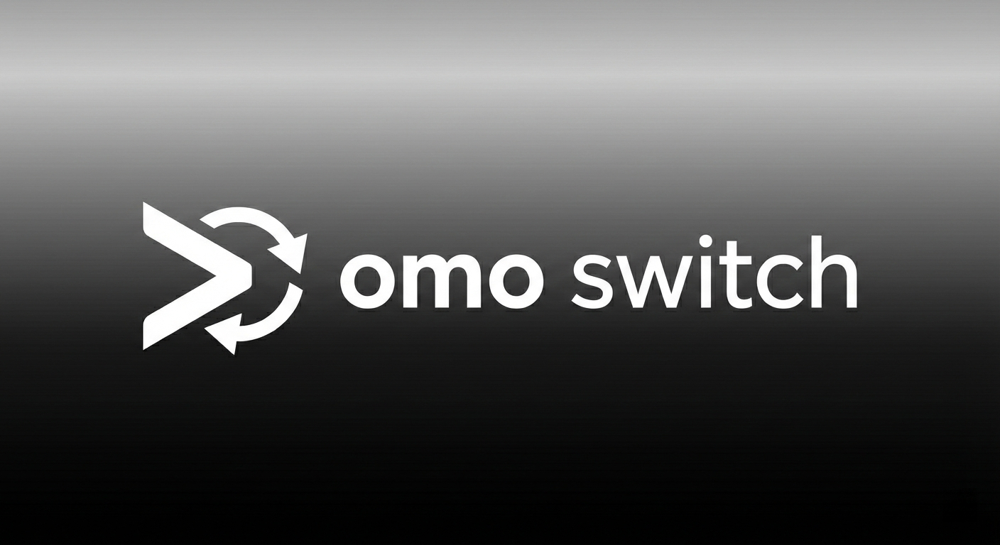

<p align="center">
  
</p>

# omo-switch

[](https://badge.fury.io/js/omo-switch-cli)
[](https://opensource.org/licenses/MIT)

A CLI tool for managing [oh-my-opencode](https://github.com/code-yeongyu/oh-my-opencode) configuration profiles.

## Why omo-switch?

**Why not just use `ocx`?**
When you need a simple, lightweight tool dedicated purely to switching between different configurations for `oh-my-opencode` or `oh-my-opencode-slim`, `omo-switch` is your best friend. It doesn't try to do everything; it focuses on making config management as easy as a single command. It's built for developers who want a straightforward way to swap setups without the overhead of more complex orchestration tools.

## Features

- 🔄 **Profile Switching** - Seamlessly switch between multiple `oh-my-opencode` configurations
- ✅ **Schema Validation** - Automatic validation against the official JSON schema
- 📦 **Dual Scope Support** - Manage both global (`user`) and project-local (`project`) profiles
- 💾 **Automatic Backups** - Your configuration is always backed up before changes
- 🖥️ **Cross-Platform** - Works on Windows (PowerShell/CMD), Linux, and macOS (XDG compatible)

- 🔀 **Dual Mode Support** - Seamlessly switch between `oh-my-opencode` (OMO) and `oh-my-opencode-slim` (SLIM) configurations

## Requirements

- **Node.js** >= 22.0.0

## Installation

### npm (Recommended)

```bash
npm install -g omo-switch-cli
```

**Note:** You can also use the shorter alias `omos` after installation.

### From Source

```bash
git clone https://github.com/Aykahshi/omo-switch.git
cd omo-switch
npm install
npm run build
npm link
```

## Quick Start

```bash
# Initialize the profile store
omo-switch init

# Import your first profile
omo-switch add ./my-config.jsonc --name "My Setup"

# List available profiles
omo-switch list

# Apply a profile
omo-switch apply my-setup
```

## Commands

### `init`

Initializes the `~/.config/omo-switch` directory, sets up the internal structure, and downloads the latest configuration schema.

```bash
omo-switch init
```

**What it does:**
- Creates the store directory structure
- Downloads the latest `oh-my-opencode` schema from GitHub (falls back to bundled if offline)
- Creates a default profile if no existing config is detected

---

### `type [type]`

Get or set the active configuration type (`omo` or `slim`). This determines how `omo-switch` interprets your configuration and where it applies changes.

```bash
# Show current type and scope overrides
omo-switch type

# Set global type to SLIM (uses oh-my-opencode-slim.json)
omo-switch type slim

# Set global type to OMO (uses oh-my-opencode.jsonc)
omo-switch type omo

# Set project-specific type override (creates .opencode/settings.json)
omo-switch type slim --scope project

# Clear project-specific override
omo-switch type --clear-project

# Interactive selection
omo-switch type --select
```

**Options:**
| Option | Description |
|--------|-------------|
| `--scope <scope>` | Target scope: `user` (global) or `project` (local) |
| `--select` | Interactively select from available types |
| `--clear-project` | Remove project-level override to use global default |

**Configuration Types:**
| Type | Description | File Pattern |
|------|-------------|--------------|
| `omo` | **Classic Mode** (Default) - Uses multiple profile files. | `oh-my-opencode.jsonc` |
| `slim` | **Slim Mode** - Uses a single file with multiple presets. | `oh-my-opencode-slim.json` |

---

### `add <file>`

Imports a configuration file as a new profile.

```bash
# Basic usage - profile ID is derived from filename
omo-switch add ./my-config.jsonc

# With custom name (ID auto-derived from name)
omo-switch add ./config.json --name "Development Mode"

# With explicit ID and name
omo-switch add ./config.json --id dev --name "Dev Config"

# Add to project scope instead of global
omo-switch add ./config.jsonc --scope project

# Overwrite existing profile with same ID
omo-switch add ./config.jsonc --id existing-id --force
```

**Options:**
| Option | Description |
|--------|-------------|
| `--id <id>` | Custom profile ID (defaults to derived from name or filename) |
| `--name <name>` | Custom display name (defaults to ID) |
| `--scope <scope>` | Target scope: `user` (global) or `project` (local). Prompts if not specified |
| `--force` | Overwrite if a profile with the same ID exists |

OMOS behavior:
- When the active type is `slim`, `add` will insert the imported configuration as a new preset under the `presets` object inside `oh-my-opencode-slim.json` instead of creating a separate profile file.

**Profile ID and filename:**
- If neither `--id` nor `--name` is provided: ID is derived from the input filename
- If only `--name` is provided: ID is derived from the name (lowercase, hyphenated)
- If only `--id` is provided: name defaults to the ID
- **Stored filename**: `<profile-id>.<original-extension>` (e.g., `config.json` + `--name test` → `test.json`)

---

### `list`

Lists all available profiles and shows which one is currently active.

```bash
# List all profiles (default)
omo-switch list

# List only global profiles
omo-switch list --scope user

# List only project profiles
omo-switch list --scope project
```

**Options:**
| Option | Description |
|--------|-------------|
| `--scope <scope>` | Filter by scope: `user`, `project`, or `all` (default: `all`) |

OMOS behavior:
- In `slim` mode, `list` displays available presets from the `presets` object inside `oh-my-opencode-slim.json` and indicates the currently selected `preset`.

---

### `show [identifier]`

Displays the configuration content. Supports merged view of applied configs.

```bash
# Show merged view of currently applied configs (default)
omo-switch show

# Show a specific profile from store
omo-switch show my-setup --scope user

# Show project profile
omo-switch show dev --scope project
```

**Options:**
| Option | Description |
|--------|-------------|
| `--scope <scope>` | View scope: `user`, `project`, or `merged` (default: `merged`) |

**Scope behavior:**
- `merged`: Shows the actual applied configs from target paths, with diff highlighting if both global and project configs exist
- `user`: Shows a profile from the global store
- `project`: Shows a profile from the project store

OMOS behavior:
- When in `slim` mode, `show` will display the OMOS single-file configuration (`oh-my-opencode-slim.json`) or a specific preset from its `presets` object when an identifier is provided.

---

### `apply <identifier>`

Validates and applies the selected profile to the `oh-my-opencode` target configuration.

```bash
# Apply a profile (searches both scopes, prefers project)
omo-switch apply my-setup

# Apply from global store specifically
omo-switch apply my-setup --scope user

# Apply to project target path
omo-switch apply dev --scope project
```

**Options:**
| Option | Description |
|--------|-------------|
| `--scope <scope>` | Target scope: `user` or `project` (default: `user`) |

**Note:** A backup is automatically created before any changes.

OMOS behavior:
- In `slim` mode, `apply` sets the `preset` field inside `oh-my-opencode-slim.json` to the selected preset ID instead of copying a profile file.

---

### `rm <profile-id>`

Removes a saved profile from the store.

```bash
# Remove with confirmation prompt
omo-switch rm my-old-profile

# Remove without confirmation
omo-switch rm my-old-profile --force

# Remove from specific scope
omo-switch rm dev --scope project
```

**Options:**
| Option | Description |
|--------|-------------|
| `--scope <scope>` | Target scope: `user` or `project` |
| `--force` | Skip confirmation prompt |

**Behavior without `--scope`:**
- Checks project scope first, then global scope
- Prompts for confirmation before deletion

OMOS behavior:
- When in `slim` mode, `rm` removes the corresponding preset from the `presets` object inside `oh-my-opencode-slim.json`.

---

### `schema refresh`

Refreshes the cached `oh-my-opencode` JSON schema.

```bash
# Download latest schema from GitHub
omo-switch schema refresh

# Use offline/bundled schema
omo-switch schema refresh --offline
```

**Options:**
| Option | Description |
|--------|-------------|
| `--offline` | Skip network request; use cached or bundled schema |

---

## OMO vs OMOS Modes

`omo-switch` supports two configuration formats:

### OMO Mode (oh-my-opencode)
- **Multi-file architecture**: Each profile is stored as a separate `.json` or `.jsonc` file
- **Profile switching**: Copy selected profile to target configuration path
- **Best for**: Users who want isolated, independent profile files

### OMOS Mode (oh-my-opencode-slim)  
- **Single-file architecture**: All presets are managed within a single `oh-my-opencode-slim.json` file.
- **Preset switching**: Switching is done by modifying the `preset` field at the top level of the file.
- **Best for**: Users who prefer a unified configuration and want to switch "on-the-fly" without copying files.
- **Usage**: Set your type to `slim` using `omo-switch type slim`.

#### Working with Slim Mode:
1. **List Presets**: `omo-switch list` shows all presets defined in your slim config.
2. **Add Preset**: `omo-switch add ./my-preset.json` reads a JSON file containing a preset definition and appends it to the `presets` object in your slim config.
3. **Apply Preset**: `omo-switch apply preset-id` updates the `preset` field in the slim config to point to `preset-id`.

### Command Behavior by Mode

| Command | OMO Mode | OMOS Mode |
|---------|----------|-----------|
| `type` | Show/set current mode | Same |
| `list` | List profile files | List presets in `presets` object |
| `add` | Import file as new profile | Add preset to `presets` object |
| `apply` | Copy profile to target path | Set `preset` field |
| `rm` | Delete profile file | Remove preset from `presets` |
| `show` | Display profile content | Display OMOS config |


## Understanding Scopes

`omo-switch` supports two scopes for profile management:

| Scope | Storage Location | Target Config Path | Use Case |
|-------|------------------|-------------------|----------|
| `user` | `~/.config/omo-switch/` | `~/.config/opencode/oh-my-opencode.jsonc` (OMO) / `~/.config/opencode/oh-my-opencode-slim.json` (OMOS) | Global profiles/presets shared across all projects |
| `project` | `<project>/.opencode/` | `<project>/.opencode/oh-my-opencode.jsonc` (OMO) / `<project>/.opencode/oh-my-opencode-slim.json` (OMOS) | Project-specific profiles/presets, ideal for team sharing via Git |


## Storage Structure

### Global Store (`~/.config/omo-switch/`)

```
~/.config/omo-switch/
├── index.json           # Profile registry with active profile ID (OMO)
├── configs/             # Profile configuration files (*.json, *.jsonc) (OMO)
├── cache/
│   └── schema/          # Cached oh-my-opencode.schema.json
└── backups/             # Timestamped configuration backups
```

### Project Store (`<project>/.opencode/`)

```
<project>/.opencode/
├── .omorc               # Project-specific active profile (OMO)
├── omo-configs/         # Project-specific profiles (OMO)
├── oh-my-opencode.jsonc # Applied project config (target) (OMO)
└── oh-my-opencode-slim.json # Applied project config (target) (OMOS)
```

## Target Configuration Paths

When applying a profile, `omo-switch` writes to:

| Scope | Platform | Primary Path | Fallback Path |
|-------|----------|--------------|---------------|
| `user` | Windows | `%USERPROFILE%\.config\opencode\oh-my-opencode.jsonc` (OMO) / `%USERPROFILE%\.config\opencode\oh-my-opencode-slim.json` (OMOS) | `%APPDATA%\opencode\oh-my-opencode.json` |
| `user` | Linux/macOS | `$XDG_CONFIG_HOME/opencode/oh-my-opencode.jsonc` (OMO) / `$XDG_CONFIG_HOME/opencode/oh-my-opencode-slim.json` (OMOS) | `~/.config/opencode/oh-my-opencode.jsonc` |
| `project` | All | `<project>/.opencode/oh-my-opencode.jsonc` (OMO) / `<project>/.opencode/oh-my-opencode-slim.json` (OMOS) | - |

## Local Development

### Prerequisites

- Node.js >= 22.0.0

### Setup

```bash
git clone https://github.com/Aykahshi/omo-switch.git
cd omo-switch
npm install
```

### Scripts

| Command | Description |
|---------|-------------|
| `npm run build` | Compile TypeScript to `dist/` |
| `npm run dev -- <args>` | Run CLI directly with ts-node |
| `npm test` | Run unit tests with Vitest |
| `npm run test:watch` | Run tests in watch mode |
| `npm run test:coverage` | Run tests with coverage report |

### Development Workflow

```bash
# Run in development mode
npm run dev -- init
npm run dev -- list
npm run dev -- add ./test-config.jsonc --name "Test"

# Build and link for global testing
npm run build
npm link
omo-switch --help
```

### Coding Guidelines

1. **File I/O**: Never use `fs` directly in command files. Use `StoreManager` or `ProjectStoreManager`.
2. **Safety**: Always create backups before overwriting configurations.
3. **Validation**: Validate all configs against the JSON schema before applying.
4. **Testing**: Use Vitest with `memfs` for filesystem mocking.
5. **Error Handling**: Use `ora` spinners for user feedback. Exit with `process.exit(1)` on failure.

### Project Structure

```
omo-switch/
├── src/
│   ├── index.ts           # CLI entry point
│   ├── commands/          # Command implementations
│   │   ├── init.ts
│   │   ├── add.ts
│   │   ├── list.ts
│   │   ├── show.ts
│   │   ├── apply.ts
│   │   ├── rm.ts
│   │   └── schema.ts
│   ├── store/             # Data persistence (global & project)
│   ├── utils/             # Helper functions
│   └── __tests__/         # Test fixtures
├── shared/                # Shared assets (schema, templates)
└── dist/                  # Compiled output
```

## Troubleshooting

### Schema Download Failures

If the tool cannot reach GitHub, it automatically falls back to a bundled schema. Use `--offline` if you're in an air-gapped environment.

### Permission Errors

Ensure your terminal has write permissions to:
- `~/.config/omo-switch/`
- `~/.config/opencode/` or `%APPDATA%/opencode/`

### Finding Backups

If something goes wrong, find your original configuration in:
- **Global**: `~/.config/omo-switch/backups/<ISO_TIMESTAMP>__oh-my-opencode.jsonc`
- **Project**: `<project>/.opencode/backups/<ISO_TIMESTAMP>__oh-my-opencode.jsonc`

### Backup Retention Policy

By default, `omo-switch` keeps backups for **30 days**. Old backup files are automatically scanned and removed whenever a new backup is created (e.g., when running `apply`).

You can customize the retention period by editing your global `settings.json` file:

**File**: `~/.config/omo-switch/settings.json`
```json
{
  "activeType": "omo",
  "backupRetentionDays": 14
}
```

Set `backupRetentionDays` to a larger number to keep backups longer, or a smaller number to save space.

## License

[MIT](LICENSE)
